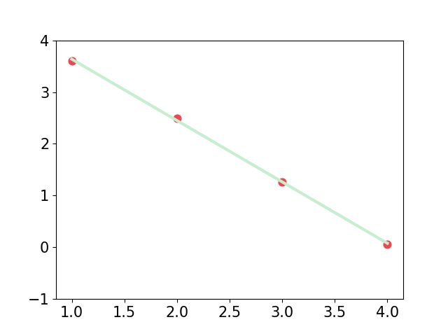
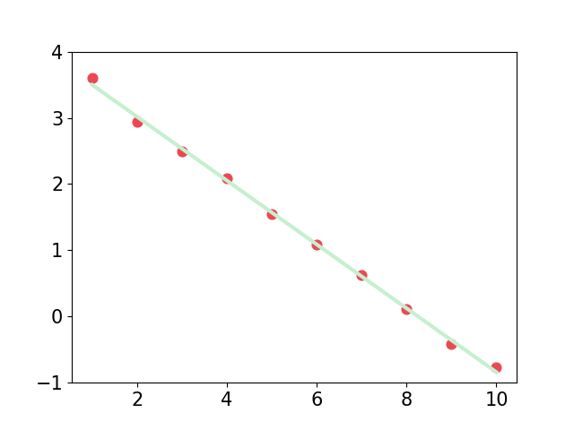
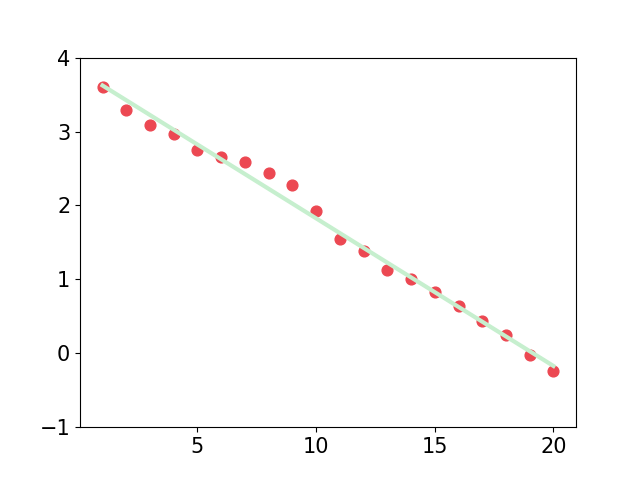

# Equi-Separation-jhwang

Verify Code for https://arxiv.org/pdf/2210.17020.pdf

The program is only verified on figure(1)-row(4)

### install

```bash
conda create -n ES python=3.9
conda activate ES
conda install pytorch==1.12.1 torchvision==0.13.1 torchaudio==0.12.1 cudatoolkit=11.3 -c pytorch
pip3 install -r requirement.txt
```

### dataset
use utils/data to generate dataset
### run

```bash
CUDA_VISIBLE_DEVICES=0 python main.py --config cfgs.yaml 
```

### conclusion

<center> optimization=adam depth=4 lr=3e-3 </center>



<center>optimization=adam depth=10 lr=1e-3</center>


<center>optimization=adam depth=20 lr=4e-3</center>